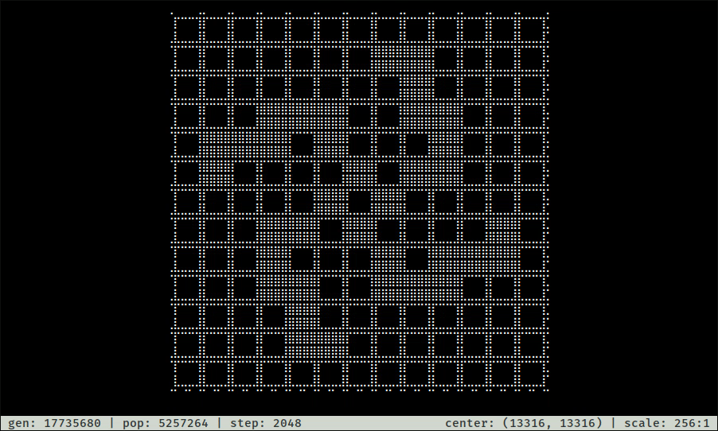

# goliard



## Installation

```
git clone https://github.com/billyrieger/smeagol
git clone https://github.com/billyrieger/goliard
cd goliard
cargo install --path . --force
```

## Usage

```
goliard <file>
```

To see a list of available key commands, press `?`.
